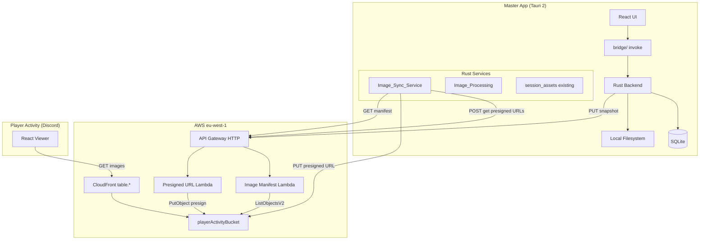
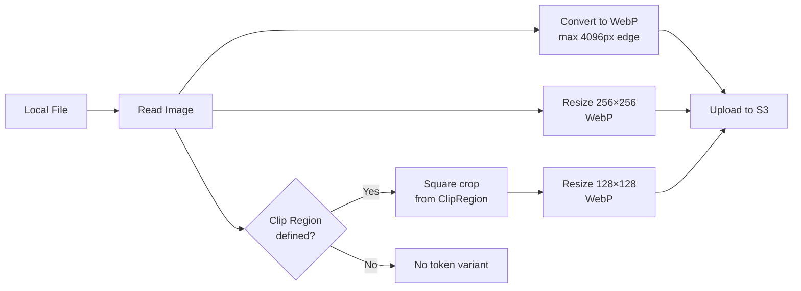
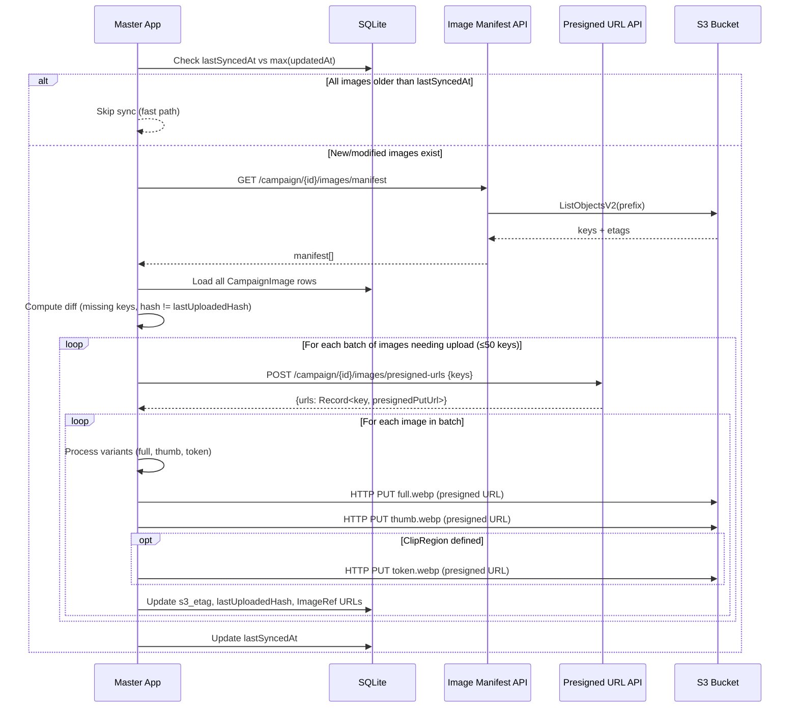

# Design Document: Image Sync and Tabletop Tokens

## Overview

This feature adds an automated image synchronization pipeline from the master-app's local SQLite/filesystem to S3, square token portrait clipping for Characters and NPCs, a map background picker from existing campaign images, and a streamlined player-activity header. The design leverages presigned PUT URLs obtained from a dedicated Presigned_URL_API Lambda for all S3 uploads, a manifest Lambda for incremental sync, and new Rust services for image processing.

**Key design decisions:**

- **Reuse the existing `playerActivityBucket`** (S3 bucket behind the `table.*` CloudFront distribution) with a new `/campaign-images/` path prefix, avoiding a separate bucket and distribution.
- **All S3 uploads via presigned PUT URLs** obtained from the Presigned_URL_API Lambda. The Rust backend does not require AWS credentials for uploads — it performs simple HTTP PUT requests with image bytes and `Content-Type: image/webp`.
- **Image processing in Rust** using the `image` crate (already a dependency for `session_assets.rs`), keeping the pipeline local-first and avoiding Lambda-based processing.
- **Manifest API and Presigned URL API as new Lambdas** on the existing HTTP API Gateway, authenticated with the same HMAC-based master token used for session sync.
- **Clip_Region stored as JSON on the CampaignImage record**, not on the entity row. The token portrait for a Character or NPC is derived from its primary image's Clip_Region. The clip region is a **square** (defined by `halfSide`), stored as a square 128×128 image; circular rendering is CSS-only at display time.

## Architecture



### Component Placement

| Component               | Location                                                                     | Responsibility                                                                                  |
| ----------------------- | ---------------------------------------------------------------------------- | ----------------------------------------------------------------------------------------------- |
| `Image_Sync_Service`    | `src-tauri/src/services/image_sync.rs`                                       | Orchestrates sync: manifest fetch, presigned URL request, diff, upload loop, timestamp tracking |
| `Image_Processing`      | `src-tauri/src/services/image_processing.rs`                                 | WebP conversion, thumbnail generation, token portrait cropping                                  |
| `Token_Clip_Editor`     | `apps/master-app/src/features/tabletop/components/token-clip-editor.tsx`     | React component for square crop UI                                                              |
| `MapBackgroundPicker`   | `apps/master-app/src/features/tabletop/components/map-background-picker.tsx` | React component for selecting existing images                                                   |
| `Image Manifest Lambda` | `infrastructure/lambdas/image-manifest/src/handler.ts`                       | Lists S3 objects under campaign prefix                                                          |
| `Presigned URL Lambda`  | `infrastructure/lambdas/presigned-upload/src/handler.ts`                     | Returns presigned PUT URLs for requested S3 keys                                                |
| CDK additions           | `infrastructure/lib/stacks/api-stack.ts`                                     | New routes + Lambdas for manifest and presigned URL endpoints                                   |

## Components and Interfaces

### Rust: Image_Sync_Service (`image_sync.rs`)

```rust
/// Entry point for session-start sync and manual sync.
pub async fn sync_campaign_images(
    pool: &SqlitePool,
    campaign_id: &str,
    sync_api_base_url: &str,
    session_token: &str,
    progress_tx: Option<tokio::sync::mpsc::Sender<SyncProgress>>,
) -> AppResult<SyncReport>

/// Quick check: can we skip sync entirely?
pub fn should_skip_sync(last_synced_at: Option<i64>, max_updated_at: i64) -> bool

/// Fetch manifest from API
async fn fetch_manifest(
    sync_api_base_url: &str,
    session_token: &str,
    campaign_id: &str,
) -> AppResult<Vec<ManifestEntry>>

/// Request presigned PUT URLs for a batch of S3 keys (max 50)
async fn request_presigned_urls(
    sync_api_base_url: &str,
    session_token: &str,
    campaign_id: &str,
    keys: &[String],
) -> AppResult<HashMap<String, String>>

/// Compare local state against manifest, return images needing upload
fn compute_sync_diff(
    images: &[CampaignImageSyncRow],
    manifest: &[ManifestEntry],
) -> Vec<SyncAction>

/// Upload image bytes to S3 via presigned PUT URL
async fn upload_via_presigned_url(
    http_client: &reqwest::Client,
    presigned_url: &str,
    image_bytes: &[u8],
) -> AppResult<()>
```

### Rust: Image_Processing (`image_processing.rs`)

```rust
/// Convert source image to WebP, respecting max dimensions.
pub fn convert_to_webp(source: &Path, max_edge_px: u32) -> AppResult<(Vec<u8>, u32, u32)>

/// Generate 256×256 thumbnail.
pub fn generate_thumbnail(source: &Path) -> AppResult<Vec<u8>>

/// Generate 128×128 token portrait from clip region.
pub fn generate_token_portrait(
    source: &Path,
    clip: &ClipRegion,
) -> AppResult<Vec<u8>>
```

### TypeScript: Tabletop Snapshot Extension

```typescript
// Addition to tabletopSnapshotSchema in packages/shared/src/sync/messages.schema.ts
tokenPortraitUrls: z.record(z.string(), z.string().url()).default({});
```

### Lambda: Image Manifest API

```typescript
// GET /campaign/{campaignId}/images/manifest
// Authorization: Bearer <master-session-token>
// Response: { images: Array<{ key: string; etag: string }> }
```

### Lambda: Presigned URL API

```typescript
// POST /campaign/{campaignId}/images/presigned-urls
// Authorization: Bearer <master-session-token>
// Request body: { campaignId: string, keys: string[] }
// Response: { urls: Record<string, string> }  (key → presigned PUT URL, valid 15 minutes)
```

### Tauri Commands (new)

```rust
#[tauri::command]
async fn sync_campaign_images_cmd(...) -> Result<SyncReport, AppError>

#[tauri::command]
async fn set_clip_region_cmd(
    campaign_image_id: &str,
    clip: Option<ClipRegion>,
) -> Result<(), AppError>

#[tauri::command]
async fn get_campaign_images_for_picker_cmd(
    campaign_id: &str,
) -> Result<Vec<CampaignImagePickerEntry>, AppError>

#[tauri::command]
async fn set_map_background_from_image_cmd(
    map_id: &str, campaign_image_id: &str,
) -> Result<Map, AppError>
```

## Data Models

### SQLite Schema Changes (new migration)

```sql
-- Migration: add clip_region and sync tracking

-- Clip region stored on the CampaignImage (defines the token portrait crop)
ALTER TABLE campaign_images ADD COLUMN clip_region_json TEXT;

-- Sync tracking on campaign_images
ALTER TABLE campaign_images ADD COLUMN s3_etag TEXT;
ALTER TABLE campaign_images ADD COLUMN last_uploaded_hash TEXT;

-- Campaign-level sync timestamp
CREATE TABLE image_sync_state (
    campaign_id TEXT PRIMARY KEY,
    last_synced_at INTEGER,
    last_sync_status TEXT NOT NULL DEFAULT 'never'
) STRICT;
```

### ClipRegion (JSON stored in `clip_region_json` on campaign_images)

```rust
#[derive(Debug, Clone, Serialize, Deserialize)]
#[serde(rename_all = "camelCase")]
pub struct ClipRegion {
    /// Center X, 0.0..1.0 relative to image width
    pub center_x: f64,
    /// Center Y, 0.0..1.0 relative to image height
    pub center_y: f64,
    /// Half-side length of the square clip, 0.05..0.5 relative to image dimensions
    pub half_side: f64,
}
```

**Validation constraints** (enforced in Rust before persist):

- `center_x - half_side >= 0.0`
- `center_x + half_side <= 1.0`
- `center_y - half_side >= 0.0`
- `center_y + half_side <= 1.0`
- `half_side >= 0.05`

### TypeScript types (packages/shared)

```typescript
// packages/shared/src/world-state/clip-region.schema.ts
export const clipRegionSchema = z
  .object({
    centerX: z.number().min(0).max(1),
    centerY: z.number().min(0).max(1),
    halfSide: z.number().min(0.05).max(0.5),
  })
  .refine(
    (c) =>
      c.centerX - c.halfSide >= 0 &&
      c.centerX + c.halfSide <= 1 &&
      c.centerY - c.halfSide >= 0 &&
      c.centerY + c.halfSide <= 1,
    { message: 'Clip region must fit within image bounds' },
  );

export type ClipRegion = z.infer<typeof clipRegionSchema>;
```

### ImageRef Extension

The existing `ImageRef` struct gains a `token_portrait_url` field:

```rust
#[derive(Debug, Clone, Serialize, Deserialize, Default)]
#[serde(rename_all = "camelCase")]
pub struct ImageRef {
    pub local: Option<String>,
    pub hash: Option<String>,
    pub thumbnail_url: Option<String>,
    pub canon_url: Option<String>,
    pub token_portrait_url: Option<String>,  // NEW
}
```

### ManifestEntry (Rust + TypeScript)

```rust
#[derive(Debug, Deserialize)]
pub struct ManifestEntry {
    pub key: String,
    pub etag: String,
}
```

```typescript
export const manifestEntrySchema = z.object({
  key: z.string().min(1),
  etag: z.string().min(1),
});
```

## S3 Path Conventions and CloudFront URL Resolution

### S3 Object Key Pattern

All campaign images are stored under the `campaign-images/` prefix in the existing `playerActivityBucket`:

```
campaign-images/<CampaignId>/<CampaignImageId>.webp          # full-resolution
campaign-images/<CampaignId>/<CampaignImageId>_thumb.webp    # 256×256 thumbnail
campaign-images/<CampaignId>/<CampaignImageId>_token.webp    # 128×128 token portrait
```

### CloudFront URL Resolution

The `table.*` CloudFront distribution already serves the `playerActivityBucket`. URLs resolve as:

```
https://table.ambercoffer.belinde.click/campaign-images/<CampaignId>/<CampaignImageId>.webp
https://table.ambercoffer.belinde.click/campaign-images/<CampaignId>/<CampaignImageId>_thumb.webp
https://table.ambercoffer.belinde.click/campaign-images/<CampaignId>/<CampaignImageId>_token.webp
```

### Why reuse `playerActivityBucket`?

1. The CloudFront distribution (`table.*`) already has CORS headers configured for the Discord Activity iframe.
2. No additional CloudFront distribution or DNS record needed.
3. The `session-assets/` prefix is already used for tactical uploads; `campaign-images/` is a parallel prefix.
4. Cache policy: campaign images are immutable (hash-based keys would be ideal but the CampaignImageId is stable; re-uploads use the same key so CloudFront invalidation is needed on re-upload — handled by setting `Cache-Control: max-age=86400` on upload).

### Upload Mechanism

All S3 uploads use **presigned PUT URLs** obtained from the Presigned_URL_API Lambda. The Rust backend does not require AWS credentials for S3 uploads.

**Flow:**

1. The `Image_Sync_Service` batches S3 object keys (up to 50 per request) and sends a POST to the Presigned_URL_API.
2. The Lambda returns a `Record<string, string>` mapping each key to a presigned PUT URL valid for 15 minutes.
3. The Rust backend performs HTTP PUT to each presigned URL with the image bytes as body and `Content-Type: image/webp` header.

**Benefits:**

- No AWS credentials needed on the GM's machine for image uploads.
- No `aws-sdk-s3` crate dependency in the Rust backend for upload operations.
- Avoids credential management complexity (no profile/config, no encrypted storage for AWS keys).
- The Lambda's IAM role handles S3 PutObject permissions.

## Image Processing Pipeline

### Processing Steps (per CampaignImage)



### WebP Conversion

- **Library:** `image` crate (already in `Cargo.toml` for `session_assets.rs`)
- **Full resolution:** max 4096px on longest edge, Lanczos3 downscale, WebP encoding
- **Thumbnail:** fit within 256×256 maintaining aspect ratio, WebP
- **Token portrait:** extract square region defined by ClipRegion (center ± halfSide), resize to 128×128, WebP

### Token Portrait Cropping Algorithm

```rust
fn crop_token_portrait(img: &DynamicImage, clip: &ClipRegion) -> DynamicImage {
    let (w, h) = img.dimensions();
    // Convert relative coords to pixel coords
    let cx = (clip.center_x * w as f64).round() as u32;
    let cy = (clip.center_y * h as f64).round() as u32;
    let half = (clip.half_side * w.min(h) as f64).round() as u32;

    // Extract square region
    let x = cx.saturating_sub(half);
    let y = cy.saturating_sub(half);
    let size = half * 2;

    let cropped = img.crop_imm(x, y, size, size);
    cropped.resize_exact(128, 128, FilterType::Lanczos3)
}
```

Note: The stored token image is a square (128×128). Circular rendering is applied at display time in the player-activity via CSS `border-radius: 50%`.

### Retry Strategy

Failed uploads retry up to 3 times with exponential backoff (1s, 2s, 4s). On final failure, the image is skipped and the error logged with `tracing::warn!`.

## Sync Flow

### Session-Start Sync



### Manual Sync (from Image Gallery)

Same flow as session-start, but:

1. Triggered by `Manual_Sync_Button` click
2. Sends progress updates via `tokio::sync::mpsc` channel → React via Tauri event
3. UI shows `uploaded / total` progress bar
4. Button disabled during sync

### Sync Diff Logic

An image needs upload when:

1. Its S3 object key is **absent** from the manifest, OR
2. Its local `hash` (SHA-256 of file content) differs from `last_uploaded_hash` stored after the previous successful upload

The `s3_etag` stored locally is compared against the manifest's `etag` as a secondary consistency check (S3 ETags for single-part uploads are MD5, not SHA-256, so direct comparison with local hash is not possible).

## Token Clip Editor UI Component

### Component: `TokenClipEditor`

**Props:**

```typescript
interface TokenClipEditorProps {
  campaignImageId: CampaignImageId;
  imageRef: ImageRef;
  clipRegion: ClipRegion | null;
  onConfirm: (clip: ClipRegion) => void;
  onRemove: () => void;
  disabled?: boolean; // true when no image assigned
}
```

**Behavior:**

- Renders the CampaignImage with a draggable/resizable square overlay
- Square constrained to image bounds (center ± halfSide within 0..1)
- Minimum halfSide: 0.05
- Live preview of the cropped square result updates within 200ms
- Confirm button persists the ClipRegion on the CampaignImage via `set_clip_region_cmd(campaignImageId, clip)`
- Remove button clears the ClipRegion and triggers S3 deletion of the token variant
- When `disabled` (no image), shows a localized message (i18n key: `tabletop.clipEditor.noImage`)

**Interaction model:**

- Drag center point to reposition
- Drag edge/corner handle to resize halfSide
- Keyboard: arrow keys move center, +/- adjust halfSide (accessibility)

## Map Background Picker Component

### Component: `MapBackgroundPicker`

**Props:**

```typescript
interface MapBackgroundPickerProps {
  campaignId: CampaignId;
  currentMapId: MapId;
  onSelect: (campaignImageId: CampaignImageId) => void;
  onUploadNew: () => void;
}
```

**Behavior:**

- Fetches all CampaignImage entries via `get_campaign_images_for_picker_cmd`
- Displays thumbnails (256×256) in a grid with titles
- Empty state: localized message (i18n key: `tabletop.mapPicker.empty`)
- On selection: calls `set_map_background_from_image_cmd` which:
  1. Reads the image dimensions
  2. Sets `imagePath` to the local path
  3. Sets `widthPx` / `heightPx` to actual pixel dimensions
  4. Derives `gridRows` from current `gridCols` and aspect ratio: `gridRows = round(gridCols * heightPx / widthPx)`
  5. Triggers session-asset upload for the active session (if live)
- "Upload new" button opens file picker, creates CampaignImage entry, then selects it

## Player-Activity Header Simplification

### Layout Changes

**Connected state** (session status = `"connected"`):

```
┌─────────────────────────────────────────────┐
│ [icon 24×24] Campaign Name (truncated 40ch) │  ← max 48px height
├─────────────────────────────────────────────┤
│                                             │
│           Tabletop Viewport                 │  ← flex: 1
│           (fills remaining)                 │
│                                             │
└─────────────────────────────────────────────┘
```

**Non-connected states** (idle, connecting, ended, error):

```
┌─────────────────────────────────────────────┐
│ [icon] Amber Coffer                         │
│        Subtitle                             │
├─────────────────────────────────────────────┤
│         Status / Connection UI              │
└─────────────────────────────────────────────┘
```

### Implementation

Modify `apps/player-activity/src/App.tsx` and extract a `<SessionHeader>` component:

```typescript
function SessionHeader({ status, campaignName }: SessionHeaderProps) {
  const { t } = useTranslation();

  if (status === 'connected') {
    return (
      <header className="player-activity-layout__header--compact">
        
        <h2 className="player-activity-layout__campaign-name">
          {campaignName ?? t('app.campaignNameFallback')}
        </h2>
      </header>
    );
  }

  return (
    <header className="player-activity-layout__header">
      <h1>{t('app.title')}</h1>
      <p>{t('app.subtitle')}</p>
    </header>
  );
}
```

### Token Portrait Rendering

In the tabletop renderer, when `tokenPortraitUrls[tokenId]` is present:

- Render an `` with `border-radius: 50%` and `object-fit: cover` at token cell size
- On image load error: fall back to `tokenLabels[tokenId]` literal label
- Accessibility: `alt` attribute uses `tokenNames[tokenId]`

## Correctness Properties

_A property is a characteristic or behavior that should hold true across all valid executions of a system — essentially, a formal statement about what the system should do. Properties serve as the bridge between human-readable specifications and machine-verifiable correctness guarantees._

### Property 1: SHA-256 Hash Idempotence

_For any_ byte sequence, computing the SHA-256 hash twice on the same content SHALL produce identical results, and the hash SHALL be a 64-character lowercase hexadecimal string.

**Validates: Requirements 1.1**

### Property 2: Sync Diff Correctness

_For any_ set of CampaignImage records (each with a `last_uploaded_hash` and an expected S3 object key) and _for any_ manifest (a list of `{ key, etag }` entries), the sync diff function SHALL flag an image as needing upload if and only if: (a) its expected object key is absent from the manifest, OR (b) its current local file hash differs from its stored `last_uploaded_hash`.

**Validates: Requirements 1.3, 2.2**

### Property 3: Image Variant Generation

_For any_ valid image (width ≥ 1, height ≥ 1) and _for any_ optional valid ClipRegion, the image processing pipeline SHALL produce exactly 2 variants when no ClipRegion is provided (full ≤ 4096px edge, thumbnail ≤ 256px edge) and exactly 3 variants when a ClipRegion is provided (full, thumbnail, and token portrait at exactly 128×128 pixels).

**Validates: Requirements 1.4, 4.3**

### Property 4: CloudFront URL Construction

_For any_ valid CampaignId and CampaignImageId, the constructed `canonUrl` SHALL equal `https://<table-host>/campaign-images/<CampaignId>/<CampaignImageId>.webp`, the `thumbnailUrl` SHALL end with `_thumb.webp`, and the `tokenPortraitUrl` (when applicable) SHALL end with `_token.webp`.

**Validates: Requirements 1.5**

### Property 5: Skip-Sync Predicate

_For any_ `lastSyncedAt` timestamp and _for any_ non-empty set of CampaignImage `updatedAt` timestamps, the `should_skip_sync` function SHALL return `true` if and only if `lastSyncedAt` is strictly greater than the maximum of all `updatedAt` values.

**Validates: Requirements 2.4**

### Property 6: UUID v7 Validation

_For any_ string, the UUID v7 validation function SHALL accept it if and only if it matches the UUID v7 format (RFC 9562 version 7: 32 hex digits with hyphens in 8-4-4-4-12 pattern, version nibble = 7, variant bits = 10xx).

**Validates: Requirements 3.3**

### Property 7: HMAC Token Auth Verification

_For any_ valid token payload (with `role` and `campaignId` claims) and _for any_ HMAC secret, signing the payload and then verifying with the same secret SHALL succeed. Verifying with a different secret or a modified payload SHALL fail. A token with `role ≠ 'master'` or with a `campaignId` claim not matching the request path SHALL be classified as forbidden (403), while a missing or structurally invalid token SHALL be classified as unauthorized (401).

**Validates: Requirements 3.4, 3.5**

### Property 8: ClipRegion Validation on CampaignImage

_For any_ CampaignImage and _for any_ triple `(centerX, centerY, halfSide)` where all are floating-point numbers in [0.0, 1.0], the ClipRegion validation SHALL accept if and only if: `centerX - halfSide ≥ 0.0` AND `centerX + halfSide ≤ 1.0` AND `centerY - halfSide ≥ 0.0` AND `centerY + halfSide ≤ 1.0` AND `halfSide ≥ 0.05`. The validated ClipRegion is persisted on the CampaignImage record.

**Validates: Requirements 4.1, 4.2**

### Property 9: Grid Rows Derivation from Aspect Ratio

_For any_ positive integers `widthPx`, `heightPx`, and `gridCols` (where gridCols ≥ 1), the derived `gridRows` SHALL equal `max(1, round(gridCols × heightPx / widthPx))`.

**Validates: Requirements 5.4**

### Property 10: Campaign Name Truncation

_For any_ string representing a campaign name, if its length exceeds 40 characters the displayed value SHALL be the first 40 characters followed by an ellipsis character ("…"), and if its length is ≤ 40 characters it SHALL be displayed unchanged.

**Validates: Requirements 6.1**

### Property 11: Tabletop Snapshot Serialization Round-Trip

_For any_ valid tabletop snapshot object (including a `tokenPortraitUrls` record with arbitrary string keys mapping to valid URL strings), serializing to JSON and parsing back with the Zod schema SHALL produce an object deeply equal to the original.

**Validates: Requirements 7.1**

## Error Handling

### Image_Sync_Service (Rust)

| Error Scenario                                      | Handling                                              | User Feedback                                           |
| --------------------------------------------------- | ----------------------------------------------------- | ------------------------------------------------------- |
| Local image file missing/unreadable                 | Skip image, log `tracing::warn!` with CampaignImageId | Included in sync report `skipped` count                 |
| S3 upload via presigned URL fails (after 3 retries) | Skip image, log error with CampaignImageId + reason   | Warning notification with failed count                  |
| Manifest API timeout (>10s)                         | Abort sync cycle, retain previous `lastSyncedAt`      | Error notification (i18n key: `sync.manifestTimeout`)   |
| Manifest API HTTP error (4xx/5xx)                   | Abort sync cycle, retain previous `lastSyncedAt`      | Error notification with status code                     |
| Image too large for WebP encoding                   | Skip image, log error                                 | Included in sync report `skipped` count                 |
| Invalid ClipRegion values                           | Reject at validation layer before persist             | Inline form validation error                            |
| Presigned URL API timeout (>10s)                    | Abort current upload batch, log error                 | Error notification (i18n key: `sync.presignedUrlError`) |
| Presigned URL API HTTP error (4xx/5xx)              | Abort current upload batch, log error                 | Error notification with status code                     |

### Image Manifest Lambda

| Error Scenario                                 | HTTP Status | Response Body                             |
| ---------------------------------------------- | ----------- | ----------------------------------------- |
| Missing `campaignId` parameter                 | 400         | `{ "error": "missing_campaign_id" }`      |
| Invalid UUID v7 format                         | 400         | `{ "error": "invalid_campaign_id" }`      |
| Missing/invalid Bearer token                   | 401         | `{ "error": "unauthorized" }`             |
| Valid token, wrong role or campaignId mismatch | 403         | `{ "error": "forbidden" }`                |
| S3 ListObjectsV2 failure                       | 502         | `{ "error": "upstream_storage_failure" }` |
| Unexpected internal error                      | 500         | `{ "error": "internal_error" }`           |

### Presigned URL Lambda

| Error Scenario                                       | HTTP Status | Response Body                             |
| ---------------------------------------------------- | ----------- | ----------------------------------------- |
| Missing `campaignId` or empty/oversized `keys` array | 400         | `{ "error": "invalid_request" }`          |
| Invalid UUID v7 format for `campaignId`              | 400         | `{ "error": "invalid_campaign_id" }`      |
| `keys` array contains more than 50 entries           | 400         | `{ "error": "too_many_keys" }`            |
| Missing/invalid Bearer token                         | 401         | `{ "error": "unauthorized" }`             |
| Valid token, wrong role or campaignId mismatch       | 403         | `{ "error": "forbidden" }`                |
| S3 presign operation failure                         | 502         | `{ "error": "upstream_storage_failure" }` |
| Unexpected internal error                            | 500         | `{ "error": "internal_error" }`           |

### Player-Activity (React)

| Error Scenario                     | Handling                                                      |
| ---------------------------------- | ------------------------------------------------------------- |
| Token portrait image fails to load | `onError` handler hides ``, shows `tokenLabels` fallback |
| Campaign name unavailable          | Display fallback i18n key (`app.campaignNameFallback`)        |
| Map background image fails to load | Show grid without background, log warning to console          |

### Retry Strategy (S3 Uploads)

```rust
const MAX_RETRIES: u32 = 3;
const BASE_DELAY_MS: u64 = 1000;

async fn upload_with_retry(/* ... */) -> AppResult<()> {
    for attempt in 0..MAX_RETRIES {
        match try_upload(/* ... */).await {
            Ok(()) => return Ok(()),
            Err(e) if attempt < MAX_RETRIES - 1 => {
                let delay = BASE_DELAY_MS * 2u64.pow(attempt);
                tracing::warn!(attempt, delay_ms = delay, "S3 upload retry");
                tokio::time::sleep(Duration::from_millis(delay)).await;
            }
            Err(e) => return Err(e),
        }
    }
    unreachable!()
}
```

## Testing Strategy

### Property-Based Tests (Vitest + fast-check)

Property-based tests validate universal correctness properties using randomized inputs. Each test runs a minimum of **100 iterations**.

**Library:** `fast-check` (already available in the monorepo test infrastructure via Vitest).

**Tag format:** `Feature: image-sync-and-tabletop-tokens, Property {N}: {title}`

Tests to implement:

| Property                        | Test Location                 | What Varies                                    |
| ------------------------------- | ----------------------------- | ---------------------------------------------- |
| P1: SHA-256 idempotence         | `src-tauri` (Rust unit test)  | Random byte arrays                             |
| P2: Sync diff correctness       | `src-tauri` (Rust unit test)  | Random image lists + manifests                 |
| P3: Image variant generation    | `src-tauri` (Rust unit test)  | Random image dimensions + optional ClipRegion  |
| P4: CloudFront URL construction | `packages/shared` (TS)        | Random CampaignId + CampaignImageId            |
| P5: Skip-sync predicate         | `src-tauri` (Rust unit test)  | Random timestamps                              |
| P6: UUID v7 validation          | `packages/shared` (TS)        | Random strings + valid UUID v7s                |
| P7: HMAC token auth             | `infrastructure/lambdas` (TS) | Random payloads + secrets                      |
| P8: ClipRegion validation       | `packages/shared` (TS)        | Random (centerX, centerY, halfSide) triples    |
| P9: Grid rows derivation        | `packages/shared` (TS)        | Random (widthPx, heightPx, gridCols)           |
| P10: Campaign name truncation   | `apps/player-activity` (TS)   | Random strings of varying length               |
| P11: Snapshot round-trip        | `packages/shared` (TS)        | Random snapshot objects with tokenPortraitUrls |

### Unit Tests (Example-Based)

- Token_Clip_Editor disabled state when no image
- Player-Activity header renders correct elements per session status
- Map background picker empty state
- Manual sync button disabled during sync
- Fallback to tokenLabels when portrait URL absent

### Integration Tests

- Manifest Lambda with mocked S3 (correct pagination handling)
- Upload retry behavior with simulated failures
- Presigned URL request batching (≤50 keys per request)
- Session-start sync end-to-end with mocked AWS
- Token portrait deletion on ClipRegion removal

### Rust Tests

Property tests in Rust use the `proptest` crate:

```rust
// Example: ClipRegion validation property test
proptest! {
    #[test]
    fn clip_region_validation(
        cx in 0.0f64..=1.0,
        cy in 0.0f64..=1.0,
        hs in 0.0f64..=0.5,
    ) {
        let valid = cx - hs >= 0.0 && cx + hs <= 1.0
                 && cy - hs >= 0.0 && cy + hs <= 1.0
                 && hs >= 0.05;
        let clip = ClipRegion { center_x: cx, center_y: cy, half_side: hs };
        assert_eq!(clip.validate().is_ok(), valid);
    }
}
```

### CDK Assertions

- Manifest Lambda route exists at `GET /campaign/{campaignId}/images/manifest`
- Presigned URL Lambda route exists at `POST /campaign/{campaignId}/images/presigned-urls`
- Manifest Lambda has S3 read permissions on the playerActivityBucket
- Presigned URL Lambda has S3 PutObject permissions on the playerActivityBucket
- Both Lambdas have correct environment variables (bucket name, auth secret ARN)
