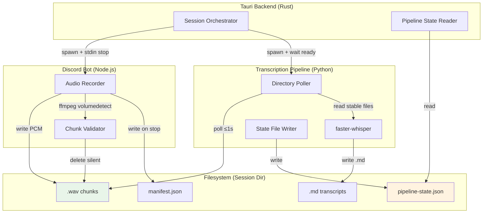

# Design Document: Session Recording & Live Transcription

## Overview

This design revamps Amber Coffer's session recording and transcription system from a batch post-session workflow to a live streaming architecture. The three core changes are:

1. **Timestamp-based chunk naming** — Replacing ordinal `0000.ogg` filenames with Unix epoch-based `{timestamp}.wav` names, enabling natural temporal ordering across multiple participants.
2. **WAV format (PCM)** — Replacing Ogg/Opus encoding with uncompressed 16-bit mono 48 kHz WAV, eliminating the decoding step before transcription.
3. **Live transcription pipeline** — A long-running Python sidecar that polls for completed `.wav` chunks and transcribes them incrementally using faster-whisper, rather than waiting for session end.

The communication between the Discord bot (Node.js) and the Transcription Pipeline (Python) is filesystem-based: completed chunks are written as `.wav` files; the pipeline polls directories and detects stable files. A JSON state file in the session directory provides lifecycle and progress information that the Tauri backend reads to expose UI state.

### Key Design Decisions

| Decision                                  | Rationale                                                                                                                                                         |
| ----------------------------------------- | ----------------------------------------------------------------------------------------------------------------------------------------------------------------- |
| WAV over Ogg/Opus                         | Removes ffmpeg decode dependency from transcription path; faster-whisper can ingest PCM directly. Disk is cheap for session-length audio (~5 MB/min mono 48 kHz). |
| Filesystem polling over IPC               | Decouples Node.js and Python processes with no shared memory or sockets; crash-resilient (files persist for later processing).                                    |
| State file over stdin/stdout protocol     | Enables the Tauri backend to observe pipeline state without maintaining a pipe; compatible with process restart and crash recovery.                               |
| Unix timestamp filenames                  | Provides cross-user temporal alignment without coordinated counters; human-readable sorting in filesystem.                                                        |
| Silence detection via ffmpeg volumedetect | Reuses existing ffmpeg dependency; proven approach from CTO reference.                                                                                            |

## Architecture

### High-Level Architecture



### Process Lifecycle Sequence

```mermaid
sequenceDiagram
    participant UI as Master App UI
    participant TB as Tauri Backend
    participant TP as Transcription Pipeline
    participant DB as Discord Bot

    UI->>TB: start_recording(session_id)
    TB->>TP: spawn python -m amber_whisper live
    TP->>TP: write state: "starting"
    TP->>TP: write state: "ready"
    TB->>TB: poll state file for "ready" (≤30s)
    TB->>DB: spawn node record (stdin=piped)
    DB->>DB: join voice channel, announce

    loop Recording active
        DB->>DB: capture opus → decode → mono PCM → .wav
        DB->>DB: finalize chunk → volumedetect
        Note over DB: silent → delete; valid → leave on disk
        TP->>TP: poll directories, find stable .wav
        TP->>TP: transcribe chunk → write .md
        TP->>TP: update state file (counts)
        TB->>TB: read state file → expose to UI
    end

    UI->>TB: stop_recording(session_id)
    TB->>DB: stdin "stop"
    DB->>DB: finalize all → write manifest
    DB->>DB: exit
    TB->>TP: write "stop" signal file
    TP->>TP: drain queue → transcribe remaining
    TP->>TP: write state: "stopped"
    TP->>TP: exit
    TB->>TB: ingest manifest to DB
```

## Components and Interfaces

### 1. Discord Bot — Recording Module (TypeScript)

**File:** `apps/discord-bot/src/record.ts` (modified)

**Responsibilities:**

- Capture per-user Opus audio from Discord voice channel
- Decode stereo 48 kHz Opus → downmix to mono → write as PCM WAV
- Name chunks using Unix epoch timestamp of chunk start
- Handle timestamp collisions with `_N` suffix
- Validate chunks via ffmpeg volumedetect after finalization
- Write `audio/manifest.json` on recording stop

**Interface changes from current:**

- `spawnOggEncoder()` → `spawnWavWriter()` (or direct PCM buffer write)
- `chunkFileName(index)` → `timestampChunkFileName(startEpochSec, collisionIndex?)`
- New: `validateChunkSilence(filePath): Promise<boolean>`
- Remove: `chunkCounters` ordinal tracking (replaced by timestamp-based naming)

### 2. Discord Bot — WAV Writer (TypeScript)

**File:** `apps/discord-bot/src/wav-writer.ts` (new)

**Responsibilities:**

- Accept raw PCM s16le samples and write WAV container
- Handle WAV header (RIFF/WAVE, fmt chunk, data chunk)
- Finalize by seeking back to update data size in header
- Minimum file size check (512 bytes)

**Interface:**

```typescript
export class WavWriter {
  constructor(outputPath: string, sampleRate: number, channels: number, bitsPerSample: number);
  write(pcmBuffer: Buffer): void;
  async finalize(): Promise<{ bytesWritten: number }>;
  async abort(): Promise<void>;
}
```

### 3. Discord Bot — Chunk Validator (TypeScript)

**File:** `apps/discord-bot/src/chunk-validator.ts` (new)

**Responsibilities:**

- Run `ffmpeg -i <file> -af volumedetect -f null /dev/null` and parse stderr
- Extract `mean_volume` from output
- Return validation result (pass/silent/error)

**Interface:**

```typescript
export type ValidationResult =
  | { status: 'valid'; meanVolume: number }
  | { status: 'silent'; meanVolume: number }
  | { status: 'error'; reason: string };

export async function validateChunk(
  filePath: string,
  silenceThresholdDbfs?: number, // default: -50
): Promise<ValidationResult>;
```

### 4. Transcription Pipeline — Live Mode (Python)

**File:** `tools/sidecars/whisper/amber_whisper/live_pipeline.py` (new)

**Responsibilities:**

- Poll `audio/discord/*/` directories for new `.wav` files
- File stability check: only process files unchanged for ≥500 ms
- Transcribe each chunk with faster-whisper (model "small", language "it")
- Write `.md` output with same base name in same directory as source
- Maintain and write `pipeline-state.json` in session root
- Handle stop signal (signal file), drain queue, exit cleanly

**Interface (CLI):**

```
python -m amber_whisper live \
  --session-dir <path> \
  --language it \
  --model small \
  --state-file <path>/pipeline-state.json \
  --signal-file <path>/pipeline-signal.json
```

**State file schema:**

```json
{
  "status": "ready" | "active" | "draining" | "stopped",
  "chunksTranscribed": 0,
  "chunksPending": 0,
  "lastUpdatedAt": 1719849600,
  "errors": []
}
```

### 5. Tauri Backend — Live Pipeline Orchestrator (Rust)

**File:** `apps/master-app/src-tauri/src/services/discord_recording.rs` (modified)

**Responsibilities:**

- Spawn Transcription Pipeline before Discord bot
- Poll pipeline state file for "ready" state (timeout 30s)
- On stop: write signal file, wait for pipeline completion (timeout 120s)
- Detect unexpected pipeline exit within 5s (via process handle)
- Expose pipeline state to UI via `pipeline_state()` query

**New struct:**

```rust
pub struct LivePipelineRuntime {
    pub session_id: String,
    pub child: Option<Child>,
    pub state_file: PathBuf,
    pub signal_file: PathBuf,
}
```

### 6. Shared Types — Manifest Schema Update (TypeScript)

**File:** `packages/shared/src/narrative/recording-manifest.schema.ts` (modified)

**Changes:**

- `codec` field: `z.literal('opus_ogg')` → `z.enum(['opus_ogg', 'pcm_wav'])`
- `channels`: `z.literal(2)` → `z.union([z.literal(1), z.literal(2)])`
- Add `z.literal(48_000)` stays unchanged for sampleRate

### 7. Session Filesystem Layout

```
sessions/{number}/
├── audio/
│   ├── discord/
│   │   ├── {discordUserId_1}/
│   │   │   ├── 1719849600.wav
│   │   │   ├── 1719849600.md        ← transcription output
│   │   │   ├── 1719849632.wav
│   │   │   ├── 1719849632.md
│   │   │   └── 1719849660_1.wav     ← collision suffix
│   │   └── {discordUserId_2}/
│   │       └── ...
│   └── manifest.json
├── transcripts/
│   └── raw-merged.txt               ← post-session merge (unchanged)
├── pipeline-state.json               ← live pipeline state
├── pipeline-signal.json              ← stop signal
└── transcription-errors.log          ← error log from pipeline
```

## Data Models

### Updated `RecordingManifestChunk` Schema

```typescript
export const recordingManifestChunkSchema = z.object({
  discordUserId: discordUserIdSchema,
  displayName: z.string().min(1),
  relativePath: z.string().min(1),
  sessionOffsetMs: z.number().int().nonnegative(),
  durationMs: z.number().int().nonnegative(),
  codec: z.enum(['opus_ogg', 'pcm_wav']),
  sampleRate: z.literal(48_000),
  channels: z.union([z.literal(1), z.literal(2)]),
});
```

### Pipeline State File Schema (Python writes, Rust reads)

```typescript
export const pipelineStateSchema = z.object({
  status: z.enum(['starting', 'ready', 'active', 'draining', 'stopped']),
  chunksTranscribed: z.number().int().nonnegative(),
  chunksPending: z.number().int().nonnegative(),
  lastUpdatedAt: z.number().int().nonnegative(),
  errors: z.array(
    z.object({
      chunkPath: z.string(),
      error: z.string(),
      timestamp: z.number().int().nonnegative(),
    }),
  ),
});
```

### Pipeline Signal File Schema (Rust writes, Python reads)

```typescript
export const pipelineSignalSchema = z.object({
  action: z.enum(['stop']),
  writtenAt: z.number().int().nonnegative(),
});
```

### Timestamp Chunk Filename Pattern

```
{unix_epoch_seconds}.wav           — first chunk at that second
{unix_epoch_seconds}_1.wav         — second chunk same second
{unix_epoch_seconds}_2.wav         — third chunk same second
```

The filename is derived from `Math.floor(Date.now() / 1000)` at the moment recording begins for that chunk.

### Rust Manifest Deserialization

The Rust `recording_ingest` service currently hardcodes Ogg assumptions. The `RecordingManifest` struct's `codec` field must accept both `"opus_ogg"` and `"pcm_wav"` as valid string literals:

```rust
#[derive(Debug, Deserialize)]
#[serde(rename_all = "camelCase")]
struct ManifestChunk {
    discord_user_id: String,
    display_name: String,
    relative_path: String,
    session_offset_ms: u64,
    duration_ms: u64,
    codec: String,          // "opus_ogg" | "pcm_wav"
    sample_rate: u32,
    channels: u8,           // 1 or 2
}
```

## Correctness Properties

_A property is a characteristic or behavior that should hold true across all valid executions of a system — essentially, a formal statement about what the system should do. Properties serve as the bridge between human-readable specifications and machine-verifiable correctness guarantees._

### Property 1: Timestamp filename generation

_For any_ valid Unix epoch timestamp in seconds (positive integer), calling the chunk filename generator with collision index 0 SHALL produce a string matching the pattern `{timestamp}.wav` with no suffix, and the timestamp in the filename SHALL equal the input timestamp.

**Validates: Requirements 1.1, 1.2**

### Property 2: Timestamp collision suffix

_For any_ valid Unix epoch timestamp and any collision index N ≥ 1, calling the chunk filename generator SHALL produce a string matching `{timestamp}_{N}.wav`, and parsing the filename back SHALL recover both the original timestamp and the collision index.

**Validates: Requirements 1.3**

### Property 3: Chunk directory path construction

_For any_ valid session directory path and any valid Discord user ID string, the chunk directory path function SHALL produce a path ending in `audio/discord/{discordUserId}/` rooted at the session directory.

**Validates: Requirements 1.4**

### Property 4: Transcription output naming convention

_For any_ valid `.wav` chunk file path, the transcription output path function SHALL produce a path with the same parent directory, the same file stem, and the extension `.md`.

**Validates: Requirements 3.4**

### Property 5: Silence threshold decision

_For any_ mean volume value in dBFS, the silence decision function SHALL return `silent` if and only if the value is strictly below -50 dBFS, and `valid` otherwise.

**Validates: Requirements 4.2**

### Property 6: Manifest audio metadata invariant

_For any_ set of newly recorded chunks serialized to a manifest, every chunk entry SHALL have `codec` equal to `"pcm_wav"`, `sampleRate` equal to `48000`, and `channels` equal to `1`.

**Validates: Requirements 5.2, 5.3**

### Property 7: Manifest timing computation

_For any_ chunk with a wall-clock start time and a session start time where chunkStart ≥ sessionStart, the `sessionOffsetMs` SHALL equal `chunkStart - sessionStart` in milliseconds, and for any chunk with wall-clock start and end times where end ≥ start, `durationMs` SHALL equal `end - start` in milliseconds.

**Validates: Requirements 5.4, 5.5**

### Property 8: Schema accepts both codec literals

_For any_ otherwise-valid manifest chunk object, the recording manifest schema SHALL successfully parse the chunk when `codec` is `"opus_ogg"` (channels: 2) and when `codec` is `"pcm_wav"` (channels: 1), without validation errors.

**Validates: Requirements 5.6**

### Property 9: Manifest merge preserves existing chunks

_For any_ valid existing manifest with N chunks and any set of M new chunks, merging SHALL produce a manifest with exactly N + M chunks where the first N chunks are byte-for-byte identical to the original chunks (preserving order, codec, channels, and all fields).

**Validates: Requirements 5.8**

### Property 10: Pipeline state file parsing

_For any_ valid pipeline state JSON object (with status in {starting, ready, active, draining, stopped}, non-negative integer counts, and a valid errors array), the state file parser SHALL produce a struct with fields matching the JSON values exactly.

**Validates: Requirements 6.7**

### Property 11: File stability check decision

_For any_ pair of (currentTime, fileLastModifiedTime) where both are positive integers in milliseconds, the file stability function SHALL return `ready` if and only if `currentTime - fileLastModifiedTime ≥ 500`, and `not_ready` otherwise.

**Validates: Requirements 7.5**

### Property 12: Pipeline state to UI state derivation

_For any_ valid pipeline state with a status field, the `transcriptionActive` derivation SHALL return `true` if and only if the status is `"active"` or `"draining"`, and `false` for all other status values.

**Validates: Requirements 8.1**

### Property 13: Missing state file fallback

_For any_ invalid, empty, or absent state file content, the pipeline state reader SHALL return `transcriptionActive` as `false`, `chunksTranscribed` as `0`, and `chunksPending` as `0`.

**Validates: Requirements 8.5**

### Property 14: Chunk processing order preservation

_For any_ sequence of chunk file paths discovered by the directory poller in a given order, the transcription pipeline SHALL process them in that same discovery order (FIFO).

**Validates: Requirements 3.3**

## Error Handling

### Discord Bot Errors

| Error Condition                        | Handling                                       | Recovery                       |
| -------------------------------------- | ---------------------------------------------- | ------------------------------ |
| Disk full / I/O error during WAV write | Close chunk, delete incomplete file, log error | Continue recording next chunks |
| ffmpeg volumedetect fails              | Treat chunk as valid, queue for transcription  | Log warning, proceed normally  |
| Timestamp collision (same second)      | Append `_N` suffix automatically               | Transparent to rest of system  |
| WAV file < 512 bytes                   | Delete file, exclude from manifest             | Silent discard, logged         |
| Voice channel disconnect               | Finalize active segment immediately            | Re-subscribe on reconnect      |

### Transcription Pipeline Errors

| Error Condition                    | Handling                                        | Recovery                                          |
| ---------------------------------- | ----------------------------------------------- | ------------------------------------------------- |
| faster-whisper model load fails    | Write state "stopped", exit with error code     | Tauri detects exit, preserves WAV files           |
| Single chunk transcription fails   | Log to `transcription-errors.log`, preserve WAV | Continue processing next chunk in queue           |
| State file write fails             | Log to stderr                                   | Pipeline continues operation (state may be stale) |
| Signal file not detected (polling) | No-op, continue polling                         | Pipeline keeps running until force-killed         |
| Pipeline crash during recording    | Tauri detects within 5s, marks state stopped    | WAV files persist, available for batch later      |

### Tauri Backend Errors

| Error Condition                     | Handling                                                   | Recovery                                                                                      |
| ----------------------------------- | ---------------------------------------------------------- | --------------------------------------------------------------------------------------------- |
| Pipeline spawn fails                | Return error to UI, do not start recording                 | User retries                                                                                  |
| Pipeline ready timeout (30s)        | Kill pipeline, return error to UI                          | User retries                                                                                  |
| Pipeline drain timeout (120s)       | Force-kill pipeline                                        | Unprocessed WAVs preserved on disk; chunk being actively processed at termination may be lost |
| Pipeline terminated during draining | Preserve all remaining WAV files                           | Available for batch transcription later regardless of termination reason                      |
| State file missing/unreadable       | Reset all counters, return default (inactive, zero counts) | UI shows pipeline as inactive                                                                 |
| Pipeline unexpected exit            | Detect via process handle, set state stopped               | Recording continues, WAVs preserved                                                           |

## Testing Strategy

### Property-Based Tests (fast-check)

Property-based tests will use **fast-check** (already in the project for the discord-bot) with a minimum of **100 iterations** per property. Each test is tagged with its design property reference.

**Target files:**

- `apps/discord-bot/test/timestamp-chunk-naming.preservation.test.ts` — Properties 1, 2, 3
- `apps/discord-bot/test/chunk-validator.preservation.test.ts` — Property 5
- `apps/discord-bot/test/manifest-builder.preservation.test.ts` — Properties 6, 7, 9
- `packages/shared/src/narrative/recording-manifest.schema.test.ts` — Property 8
- `tools/sidecars/whisper/tests/test_live_pipeline_properties.py` — Properties 4, 10, 11, 12, 13, 14

**Configuration:**

- TypeScript: `fc.assert(fc.property(...), { numRuns: 100 })`
- Python: `@given(...)` with `@settings(max_examples=100)` (Hypothesis, already in dev deps)

**Tag format:** `// Feature: session-recording-live-transcription, Property N: <text>`

### Unit Tests (example-based)

| Component             | Test File                                            | Coverage                                                            |
| --------------------- | ---------------------------------------------------- | ------------------------------------------------------------------- |
| WAV writer            | `apps/discord-bot/test/wav-writer.test.ts`           | Header correctness, finalize size update, abort cleanup             |
| Chunk validator       | `apps/discord-bot/test/chunk-validator.test.ts`      | Zero-byte detection, ffmpeg failure fallback, valid/silent examples |
| Manifest builder      | `apps/discord-bot/test/manifest-builder.test.ts`     | Empty session, single chunk, collision handling                     |
| Pipeline state reader | Rust unit tests in `recording_ingest.rs`             | Missing file, malformed JSON, valid state                           |
| Live pipeline         | `tools/sidecars/whisper/tests/test_live_pipeline.py` | File discovery, stability timeout, drain behavior                   |

### Integration Tests

| Scenario                            | Approach                                                         |
| ----------------------------------- | ---------------------------------------------------------------- |
| Full recording → transcription flow | Manual test with Discord voice channel (requires bot token)      |
| Pipeline spawn + ready detection    | Test helper spawning mock pipeline that writes state file        |
| Pipeline stop + drain               | Test helper with mock pipeline processing queue then exiting     |
| WAV format validation               | Known audio sample → write → verify ffprobe output               |
| Manifest backward compatibility     | Parse legacy `opus_ogg` manifest alongside new `pcm_wav` entries |
