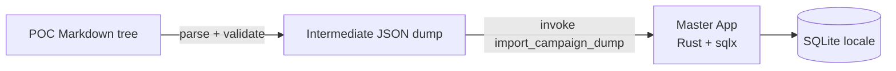

# ADR 0007: Import di campagne dal POC Markdown

**Stato**: Accettato — implementato (stadio 1 + 2)  
**Data**: 2026-05-17

## Contesto

Il POC `_readonly/campagna-poc/` mantiene un'intera campagna in file Markdown organizzati per cartelle (`personaggi/`, `png/`, `ambientazione/luoghi/`, `ambientazione/nazioni/`, `ambientazione/concetti/`, `resoconti/`, `spunti/`). Per il primo dogfooding di Amber Coffer serve un **tool di import** che converta questa struttura nelle tabelle SQLite del master-app.

Vincoli:

- L'accesso al DB è esclusivamente lato Rust ([ADR 0002](./0002-rust-sqlx-data-layer.md)).
- I tipi di dominio sono in TypeScript + Zod (`packages/shared`) e in Rust (mirror).
- Il modello è system-agnostic ([ADR 0005](./0005-system-agnostic-domain-model.md)).
- Le immagini seguono la strategia ibrida ([ADR 0006](./0006-image-storage-strategy.md)).
- Il mapping campo-per-campo è già documentato in [docs/migration/entity-templates.md](../migration/entity-templates.md) § "Mapping POC → Amber Coffer".

## Decisione

### Architettura a due stadi

1. **Stadio 1 — Estrattore TypeScript** (`tools/migrate-from-poc/`):
   - Legge l'albero Markdown della sorgente (`--source <path>`).
   - Per ogni file applica un **parser per tipo** (`character`, `npc`, `location`, `faction`, `lore_note`, `narrative_seed`, `session_recap`).
   - Valida ogni record con gli **Zod schema** di `@amber/shared` (riusa esattamente i tipi di dominio).
   - Emette un singolo file JSON di "dump intermedio" con struttura `{ version, sourceMeta, entities: { characters, npcs, locations, factions, loreNotes, narrativeSeeds, sessions } }`.
   - **Niente accesso a SQLite**: il tool è puro estrattore.

2. **Stadio 2 — Importer Tauri** (comando `migrate.import_campaign_dump` in `apps/master-app/src-tauri/src/commands/migrate.rs`):
   - Riceve il path del JSON dump.
   - Verifica versione dump e schema.
   - Applica in transazione SQLite: insert/update idempotente per `id` (UUID v7 generato in stadio 1).
   - Copia gli asset immagine in L1 (`$APPDATA/amber-coffer/images/<campaignId>/<entityId>/...`).
   - Restituisce un report (`imported`, `skipped`, `errors`).

### Perché due stadi

- **Pure validation upstream**: l'estrattore è testabile a fondo senza Tauri/SQLite.
- **Single source of truth dei tipi**: Zod schemas di `packages/shared` validano in TS; lo stesso DTO arriva a Rust serializzato JSON e deserializzato con `serde` su tipi mirror.
- **Reversibilità**: il dump JSON è un artefatto ispezionabile/diff-abile, utile per replay e debug.
- **Niente Python**: il POC usa Python per la build del sito pubblico, ma per l'import scegliamo TS per riusare Zod (`packages/shared`) ed evitare un terzo runtime nel monorepo.

### Idempotenza

Lo stadio 1 genera ID stabili così:

- Se nel frontmatter Markdown è presente un campo `amber_id`, viene usato come UUID v7.
- Altrimenti viene generato un UUID v7 deterministico da `(campaignId, entityKind, slug-del-file)` via hash → name → v5? **Decisione MVP**: UUID v7 random e annotato nel frontmatter di un file di mapping `<source>/.amber-mapping.json` (gitignored), così rerun sullo stesso albero produce stessi ID.

Lo stadio 2 fa `INSERT OR REPLACE` (in pratica `INSERT ON CONFLICT(id) DO UPDATE`) per garantire che rerun aggiornino senza duplicare.

### Mapping del contenuto

Il dettaglio campo-per-campo è in [entity-templates.md § Mapping POC → Amber Coffer](../migration/entity-templates.md). In sintesi:

- I metadati testuali del POC (`**Regione:**`, `**Ambito:**`, ...) sono estratti via regex/parser di "blocchi metadati" prima del primo header `##`.
- Le sezioni `## Aspetto`, `## Riferimento visivo`, `## Eventi interessanti`, `## Note DM` sono separate per heading.
- Le sezioni libere dei luoghi (`## Economia e commercio`, ecc.) finiscono come `Location.sections[]`.
- Le immagini `` sono risolte sul filesystem sorgente e copiate in L1.

### Mapping kind dei `LoreNote`

Il file in `ambientazione/concetti/<slug>.md` ha kind dedotto dallo slug:

| Slug contiene | `LoreNote.kind` |
|---------------|-----------------|
| `religione`, `religioni` | `religion` |
| `economia`, `commercio` | `economy` |
| `geografia` | `concept` (con tag `geography`) |
| `storia` | `history` |
| `tecnomagia`, `magia` | `concept` (tag `magic`) |
| `cultura`, `societa` | `culture` |
| `cosmologia`, `geometria-planare` | `cosmology` |
| altro | `custom` |

L'utente può rifinire il `kind` dall'UI dopo l'import.

### Scope del tool (implementato)

- **Stadio 1** (`tools/migrate-from-poc/`): parser Markdown POC (metadati `**Chiave:**`, sezioni `##`), mapping per tutte le cartelle in scope, validazione Zod, dump JSON + `assets[]`, ID stabili via `<source>/.amber-mapping.json`.
- **Stadio 2** (`import_campaign_dump` in `apps/master-app/src-tauri`): upsert transazionale SQLite + copia immagini in L1 (`$APPDATA/amber-coffer/images/<campaignId>/<entityId>/`).
- **Session recap**: campi su `Session` — `summary`, `eventsBody`, `gmNotes`, `publicSummary`, `locationsVisited`, `npcsEncountered`, `playedAt` (migration `20260517000007`).
- **Appearance**: campo `personality` per `## Personalità` (JSON, senza migration SQL).
- **Fuori scope**: audio `sessione/audio/`, trascrizioni, auto-creazione `Campaign`.

## Conseguenze

### Positive

- Validazione centralizzata via Zod = una sola fonte di verità sui tipi.
- Tool isolato in `tools/migrate-from-poc/`: non infetta runtime app.
- Dump JSON serve anche per backup/export futuro (round-trip).
- Idempotente: il GM può ri-eseguire dopo aggiornamenti POC.

### Negative

- Due stadi: deploy/UX più complessi della singola CLI. Mitigazione: master-app espone un wizard "Import campaign…" che invoca entrambi gli stadi.
- Mapping testuale fragile: i file POC sono human-written, le regex possono fallire. Mitigazione: errori non bloccanti, report dettagliato, possibilità di correggere il sorgente o editare il dump prima dello stadio 2.

## Alternative considerate

- **Python script + insert diretto via sqlx-mock**: scartato. Niente accesso DB fuori Rust.
- **Comando Tauri singolo che parsa e inserisce**: scartato. Niente testabilità pura dell'estrattore, accoppiamento parser-storage.
- **Riusare la pipeline `build_public_site.py` del POC**: scartato. Quel tool produce HTML/Jekyll, non JSON di dominio.

## Riferimenti

- POC parsing baseline: `_readonly/campagna-poc/tools/scripts/campagna_paths.py`, `rebuild_png_index.py`, `png_catalog.py`.
- Mapping campi: [docs/migration/entity-templates.md](../migration/entity-templates.md).
- Convenzioni entità: [.cursor/rules/45-entity-conventions.mdc](../../.cursor/rules/45-entity-conventions.mdc).
